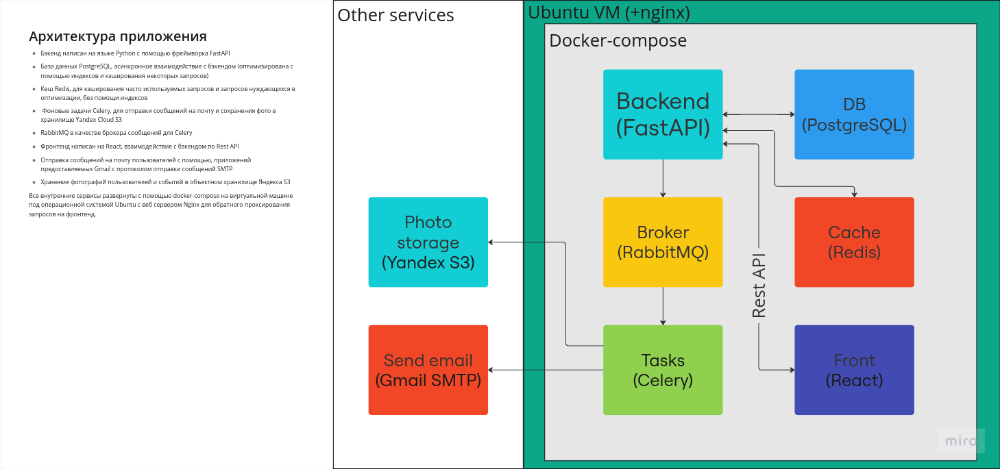

# [Помоги.рф](http://176.123.167.12/)
### Проект `Помоги.рф` разработанный на соревнованиях по спортивному программированию в категории продуктовое программирование от Федерации Спортивного Программирования Орловской области (2 место)
---
#### Данное приложение создано для объединения в едином информационном пространстве волонтеров, волонтерских организаций, других инициатив помощи людям, всех неравнодушных и, конечно же, тех, кто нуждается в поддержке.
#### С помощью общей карты событий пользователи могут легко находить ближайшие мероприятия или инициативы, чтобы оказывать или запрашивать помощь. События сортируются в зависимости от местоположения пользователя, что делает процесс максимально удобным.
#### Приложение также предоставляет возможность откликнуться на событие. В этом случае автор события получит на свою почту уведомление о вашем желании участвовать, а также ваши контактные данные. После взаимодействия с организацией или конкретным человеком вы сможете оставить комментарий с оценкой на их странице. Этот отзыв будет виден всем пользователям, включая контролирующие органы, и будет влиять на позицию пользователя в общем рейтинге.
--- 
### Архитектура и стек технологий:
